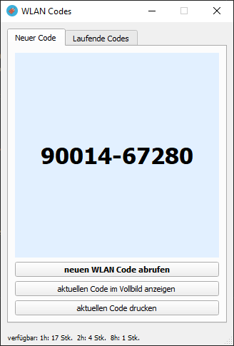
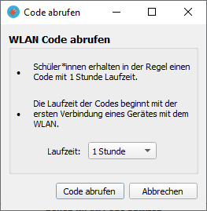
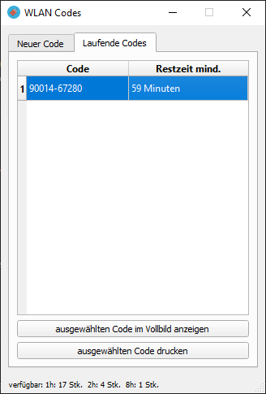

# WLAN-Codes

*Einfache Ausgabe von WLAN-Codes an Lernende in Bildungseinrichtungen*

## Screenshots
  

  

Abrufen von Codes mit gewünschter Laufzeit. Anzeige der verfügbaren Codes in der Statuszeile. Drucken/Export als PDF möglich.

Erneutes Abrufen bereits laufender Codes.

Anzeige des Codes im Vollbild am interaktiven Whiteboard.

## Funktionen für Lehrende
- Gibt WLAN-Codes aus, die aus einem WLAN-Controller mit verschiedenen Laufzeiten als multi-use keys für die mehrfache Verwendung durch eine Lerngruppe exportiert worden sind
- Lehrer oder Dozenten können im Vollbildmodus den Code für BYOD Geräte am Interactive Whiteboard anzeigen
- Codes können während ihrer Mindestlaufzeit (Laufzeit ab dem Abruf) im Tab "Laufende Codes" erneut angezeigt werden

## Funktionen für Administratoren
- Administratoren fügen der Datenbank Codes über ein grafisches Importskript hinzu
- Das Skript erwartet eine Textdatei mit einem Importcode pro Zeile
- Die Codes werden in einer sqlite-DB verwaltet und beim Abruf mit einem Zeitstempel und Benutzername versehen

### BUGS
- momentan fest eingestellter Export-Ordner für PDF
- vorbereitete DB muss momentan vorhanden sein, sollte aber vom Programm generiert werden

## Geplante Features
- Import direkt aus PDF Dateien, die sich z.B. aus UniFi Contollern exportieren lassen

